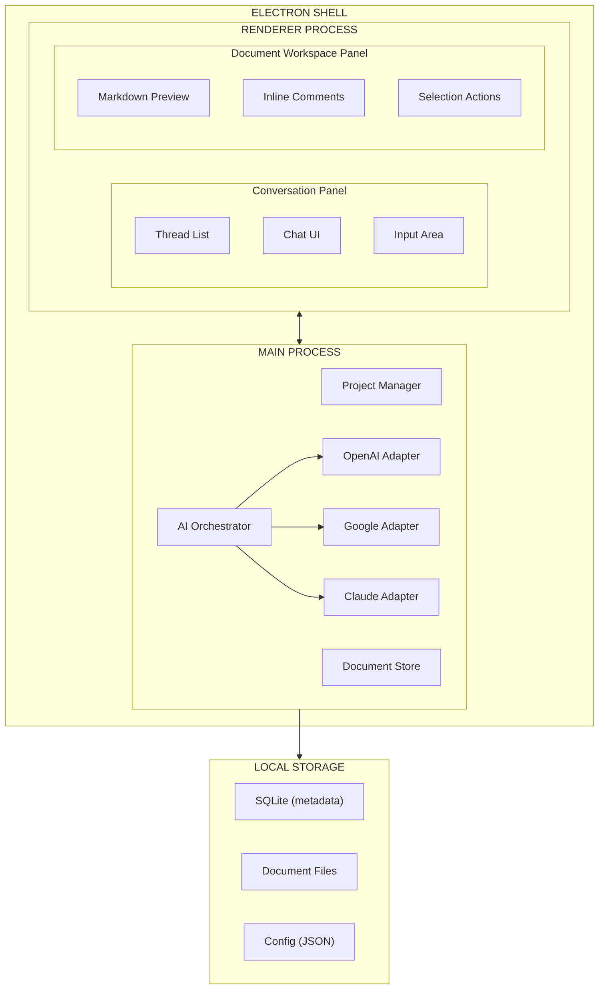

# Keystone - Technical Design Document

> **Version**: 0.1.0 (Draft)  
> **Last Updated**: 2026-02-05  
> **Related**: [PRD](./PRD.md)

## 1. Overview

This document describes the technical architecture for Keystone, an Electron-based desktop application for AI-assisted software architecture documentation.

### 1.1 Design Goals

| Goal | Description |
|------|-------------|
| **Local-first** | Data stored locally by default; cloud sync optional |
| **Provider-agnostic** | Swap AI providers without code changes |
| **Extensible** | Plugin architecture for new agents and document types |
| **Responsive** | Sub-second UI interactions, streaming AI responses |

---

## 2. System Architecture

### 2.1 High-Level Architecture



### 2.2 Process Model

| Process | Responsibilities |
|---------|-----------------|
| **Main** | IPC handling, file system, AI orchestration, window management |
| **Renderer** | UI rendering, user interactions, real-time updates |
| **Worker** *(optional)* | Heavy parsing, background sync |

---

## 3. Component Design

### 3.1 Project Manager

Handles project lifecycle and file structure.

```typescript
interface Project {
  id: string;
  name: string;
  path: string;              // Local filesystem path
  documents: DocumentRef[];
  threads: ThreadRef[];
  createdAt: Date;
  updatedAt: Date;
}

interface ProjectManager {
  create(name: string, path: string): Promise<Project>;
  open(path: string): Promise<Project>;
  save(project: Project): Promise<void>;
  export(project: Project, format: 'zip' | 'folder'): Promise<string>;
}
```

**File Structure**:
```
/project-name/
├── keystone.json          # Project manifest
├── documents/
│   ├── PRD.md
│   ├── TDD.md
│   └── adrs/
│       ├── ADR-001.md
│       └── ADR-002.md
├── threads/
│   ├── thread-abc123.json
│   └── thread-def456.json
└── .keystone/
    ├── cache/
    └── history/
```

### 3.2 Document Store

Manages document CRUD and versioning.

```typescript
interface Document {
  id: string;
  type: 'prd' | 'tdd' | 'adr';
  title: string;
  content: string;           // Markdown
  comments: Comment[];
  version: number;
  linkedThreads: string[];   // Thread IDs
  linkedADRs: string[];      // ADR IDs (for PRD/TDD)
  createdAt: Date;
  updatedAt: Date;
}

interface Comment {
  id: string;
  agentId: string;           // Which agent created it
  range: { start: number; end: number };  // Character offsets
  content: string;
  status: 'open' | 'resolved' | 'dismissed';
  threadId?: string;         // If discussion started
}

interface DocumentStore {
  get(id: string): Promise<Document>;
  save(doc: Document): Promise<void>;
  getHistory(id: string): Promise<DocumentVersion[]>;
  rollback(id: string, version: number): Promise<Document>;
}
```

### 3.3 Conversation Engine

Manages threads, messages, and context.

```typescript
interface Thread {
  id: string;
  projectId: string;
  parentThreadId?: string;   // For branched threads
  documentId?: string;       // Scoped to document section
  selectionRange?: { start: number; end: number };
  messages: Message[];
  status: 'active' | 'archived';
  createdAt: Date;
  updatedAt: Date;
}

interface Message {
  id: string;
  role: 'user' | 'assistant' | 'system';
  content: string;
  agentId?: string;          // Which specialist agent
  attachments?: Attachment[];
  createdAt: Date;
}

interface ConversationEngine {
  createThread(projectId: string, context?: ThreadContext): Promise<Thread>;
  sendMessage(threadId: string, content: string): AsyncIterable<MessageChunk>;
  branchThread(threadId: string, fromMessageId: string): Promise<Thread>;
}
```

---

## 4. AI Orchestration

### 4.1 Orchestrator

Routes requests to specialist agents and synthesizes responses.

```typescript
interface Orchestrator {
  process(request: AgentRequest): AsyncIterable<AgentResponse>;
  getActiveAgents(): AgentInfo[];
  registerAgent(agent: Agent): void;
}

interface AgentRequest {
  threadId: string;
  message: string;
  context: {
    documentType?: 'prd' | 'tdd' | 'adr';
    action: 'inquiry' | 'refinement' | 'proactive';
    selection?: { content: string; range: Range };
    recentDocuments: Document[];
  };
}

interface AgentResponse {
  agentId: string;
  type: 'text' | 'document_edit' | 'comment' | 'adr_suggestion';
  content: string;
  confidence: number;
}
```

### 4.2 Agent Interface

All specialist agents implement this interface:

```typescript
interface Agent {
  id: string;
  name: string;
  specialty: string;
  systemPrompt: string;
  
  canHandle(request: AgentRequest): boolean;
  process(request: AgentRequest, llm: LLMClient): AsyncIterable<AgentResponse>;
}
```

### 4.3 Specialist Agent Implementations

| Agent | Trigger Conditions | Output Types |
|-------|-------------------|--------------|
| **RequirementsAnalyst** | PRD edits, "what/why" questions | text, document_edit |
| **TechnicalArchitect** | TDD edits, "how" questions | text, document_edit |
| **DecisionAnalyst** | Decision changes detected | adr_suggestion, text |
| **Critic** | After major edits, explicit review requests | comment, text |
| **UXAdvisor** | User flow discussions, UI mentions | text, comment |
| **SecurityAnalyst** | Auth, data, API discussions | comment, text |
| **CoherenceChecker** | Cross-document edits | comment |

### 4.4 Decision Detection

The DecisionAnalyst monitors for decision pivots:

```typescript
interface DecisionDetector {
  // Analyzes thread for decision changes
  detectPivot(thread: Thread, documents: Document[]): DecisionPivot | null;
}

interface DecisionPivot {
  previousDecision: string;
  newDecision: string;
  context: string;
  affectedDocuments: string[];
  suggestedADR: Partial<ADRDocument>;
}
```

---

## 5. AI Provider Adapters

### 5.1 Provider Interface

```typescript
interface LLMClient {
  chat(messages: ChatMessage[], options?: ChatOptions): AsyncIterable<string>;
  getUsageStatus(): Promise<UsageStatus>;
}

interface ChatOptions {
  model?: string;
  temperature?: number;
  maxTokens?: number;
  systemPrompt?: string;
}

interface UsageStatus {
  provider: string;
  tier: string;
  remainingQuota?: number;   // If known
  resetTime?: Date;
}
```

### 5.2 Subscription Authentication

Each adapter handles subscription-based auth:

| Provider | Auth Method | Subscription Detection |
|----------|-------------|----------------------|
| **OpenAI** | Session cookies / OAuth | Check account tier via API |
| **Google** | Google OAuth | Verify Gemini Advanced subscription |
| **Anthropic** | Session cookies / API key | Check Claude Pro status |

```typescript
interface ProviderAdapter extends LLMClient {
  authenticate(): Promise<AuthResult>;
  checkSubscription(): Promise<SubscriptionInfo>;
  onQuotaExhausted(handler: () => void): void;
}
```

### 5.3 Fallback Strategy

```
1. User sends message
2. Orchestrator routes to primary provider
3. If quota exhausted:
   a. Notify user
   b. Offer: wait, switch provider, or use API key
4. If API key fallback enabled:
   a. Warn about token costs
   b. Proceed with metered usage
```

---

## 6. Data Model

### 6.1 Storage Strategy

| Data Type | Storage | Format |
|-----------|---------|--------|
| Project metadata | SQLite | Structured |
| Documents | Filesystem | Markdown |
| Threads | Filesystem | JSON |
| Comments | Embedded in thread JSON | JSON |
| User preferences | Filesystem | JSON |
| AI provider auth | OS Keychain | Encrypted |

### 6.2 Database Schema

```sql
-- Projects table
CREATE TABLE projects (
  id TEXT PRIMARY KEY,
  name TEXT NOT NULL,
  path TEXT NOT NULL UNIQUE,
  created_at DATETIME DEFAULT CURRENT_TIMESTAMP,
  updated_at DATETIME DEFAULT CURRENT_TIMESTAMP
);

-- Document metadata (content in filesystem)
CREATE TABLE documents (
  id TEXT PRIMARY KEY,
  project_id TEXT REFERENCES projects(id),
  type TEXT CHECK(type IN ('prd', 'tdd', 'adr')),
  title TEXT NOT NULL,
  filename TEXT NOT NULL,
  version INTEGER DEFAULT 1,
  created_at DATETIME DEFAULT CURRENT_TIMESTAMP,
  updated_at DATETIME DEFAULT CURRENT_TIMESTAMP
);

-- Thread metadata (messages in filesystem)
CREATE TABLE threads (
  id TEXT PRIMARY KEY,
  project_id TEXT REFERENCES projects(id),
  document_id TEXT REFERENCES documents(id),
  parent_thread_id TEXT REFERENCES threads(id),
  status TEXT DEFAULT 'active',
  created_at DATETIME DEFAULT CURRENT_TIMESTAMP,
  updated_at DATETIME DEFAULT CURRENT_TIMESTAMP
);

-- Full-text search for documents
CREATE VIRTUAL TABLE documents_fts USING fts5(
  title, content, content=documents
);
```

---

## 7. UI Components

### 7.1 Component Hierarchy

```
App
├── TitleBar
├── Sidebar
│   └── ProjectList
├── MainContent
│   ├── ConversationPanel
│   │   ├── ThreadList
│   │   ├── ChatView
│   │   │   ├── MessageList
│   │   │   └── MessageInput
│   │   └── ThreadBranches
│   └── DocumentPanel
│       ├── DocumentTabs
│       ├── MarkdownPreview
│       │   ├── SelectionToolbar
│       │   └── InlineComments
│       └── DocumentOutline
└── StatusBar
```

### 7.2 Key Interactions

#### Selection Actions
```typescript
interface SelectionAction {
  type: 'inquire' | 'refine';
  selection: {
    documentId: string;
    text: string;
    range: { start: number; end: number };
  };
}

// Handler creates scoped thread
function handleSelectionAction(action: SelectionAction): Thread {
  return conversationEngine.createThread(projectId, {
    documentId: action.selection.documentId,
    selectionRange: action.selection.range,
    initialContext: action.selection.text,
    mode: action.type
  });
}
```

#### Comment Interaction
```typescript
interface CommentClick {
  commentId: string;
  action: 'view' | 'start_thread' | 'resolve' | 'dismiss';
}

function handleCommentClick(event: CommentClick) {
  if (event.action === 'start_thread') {
    const thread = conversationEngine.createThread(projectId, {
      fromComment: event.commentId
    });
    ui.openThread(thread.id);
  }
}
```

---

## 8. Technology Stack

| Layer | Technology | Rationale |
|-------|------------|-----------|
| **Runtime** | Node.js (latest LTS) | Electron compatibility, long-term support |
| **Framework** | Electron | Cross-platform desktop, mature ecosystem |
| **UI** | React + TypeScript | Component model, type safety |
| **State** | Zustand | Lightweight, minimal boilerplate |
| **Styling** | Tailwind CSS | Rapid UI development, dark mode |
| **Markdown** | unified/remark + rehype | Extensible parsing, custom plugins |
| **Editor** | CodeMirror | Performant, extensible text editing |
| **Database** | better-sqlite3 | Sync API, no native compilation issues |
| **IPC** | electron-trpc | Type-safe main/renderer communication |

---

## 9. Security Considerations

| Concern | Mitigation |
|---------|------------|
| **API credentials** | Stored in OS keychain (keytar) |
| **Local data** | Optional encryption at rest |
| **AI context** | User controls what's sent to providers |
| **Updates** | Signed releases via electron-builder |

---

## 10. Performance Targets

| Metric | Target |
|--------|--------|
| App launch | < 2 seconds |
| Document open | < 500ms |
| AI response start | < 1 second (streaming) |
| UI frame rate | 60 fps |
| Memory usage | < 500MB baseline |

---

## 11. Future Considerations

- **Collaboration**: Real-time multi-user editing (CRDTs)
- **Git integration**: Version documents alongside code
- **Plugin system**: Custom agents and document types
- **Local LLMs**: Ollama/LM Studio integration
- **Templates**: Starter templates for common architectures

---

## Appendix A: ADR Document Structure

```markdown
# ADR-XXX: [Title]

## Status
[Proposed | Accepted | Deprecated | Superseded]

## Context
[What is the issue? What forces are at play?]

## Decision
[What is the change being proposed/done?]

## Consequences
[What are the positive and negative outcomes?]

## Related
- Thread: [link to originating conversation]
- Supersedes: [link to previous ADR if applicable]
```
